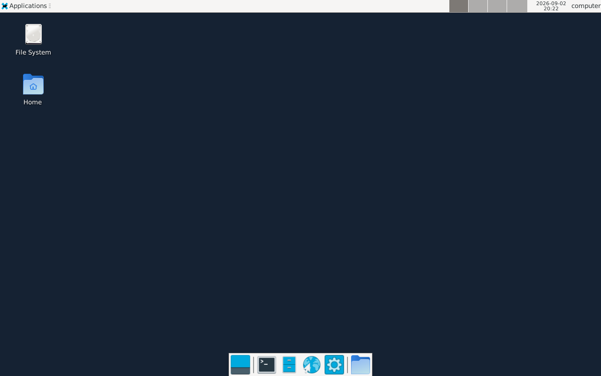

# MCP Virtual Computer

<!-- mcp-name: io.github.flujo-app/mcp-virtual-computer -->


A VM for your agent. And for you.
- click the mug to switch between a virtual desktop or a real one
- unplug the network cable and cut network access
- use the computer screen like a normal screen
- copy and paste text between the host browser and the Xfce desktop
- model can use terminal, create/read/edit files, see the screen, click, type
- little fun thing: if either you or the llm types text, you see that on the keyboard; if one uses the cursor, you see the mouse move on the table.
- automatically installs Docker Desktop on Windows for local mode, or flyctl for Fly mode

## MCP client example

### Local Docker (default)

```json
{
  "mcpServers": {
    "virtual-computer": {
      "command": "uvx",
      "args": ["mcp-virtual-computer"],
      "env": {
        "COMPUTER_ID": "agent-workstation",
        "DESKTOP_ENVIRONMENT": "true",
        "NETWORK_ACCESS": "true",
        "AUTO_INSTALL_DOCKER": "true",
        "EXPOSE_LIFECYCLE_TOOLS": "false"
      }
    }
  }
}
```

### Fly.io Machine
On a fresh machine, start the MCP once, run the exact `flyctl auth login` command shown by its error, and restart the MCP client
```json
{
  "mcpServers": {
    "virtual-computer-fly": {
      "command": "uvx",
      "args": ["mcp-virtual-computer", "--backend", "fly"],
      "env": {
        "COMPUTER_ID": "agent-workstation",
        "DESKTOP_ENVIRONMENT": "true",
        "NETWORK_ACCESS": "true",
        "AUTO_INSTALL_FLYCTL": "true",
        "EXPOSE_LIFECYCLE_TOOLS": "false"
      }
    }
  }
}
```


## What it exposes

- `terminal_execute` — run a command in the configured Docker container or Fly Machine.
- `read_file` — read a UTF-8 text file relative to `/workspace` or by absolute path.
- `write_file` — atomically write a UTF-8 text file.
- `edit_file` — replace one exact text match, or all matches when requested.
- `computer_ui` — open or attach the Three.js computer view. Its result includes
  both the MCP App `resource_uri` and a real loopback `url`/`dashboard_url` that
  opens in an external browser, including for stdio clients.

`DESKTOP_ENVIRONMENT` defaults to `true`. With the real desktop enabled it
additionally exposes:

- `look_at_screen` — return the current PNG framebuffer, AT-SPI snapshot, or both.
- `click`, `type`, and `scroll` — interact by AT-SPI element reference or coordinates.
- `list_windows` and `switch_window` — enumerate and activate real Xfce windows.
- `move_window`, `maximize_window`, `restore_window`, `minimize_window`, and `close_window` — control a selected window by ID, title, or class.
- `computer://screen/current.png` — current live framebuffer resource.
- `computer://screen/accessibility.json` — Playwright-like AT-SPI tree with element refs, roles, names, actions, focus state, and screen bounds.

The MCP App can always call `runtime_status`, `set_network_access`, and `set_desktop_environment`. Set `EXPOSE_LIFECYCLE_TOOLS=true` to additionally expose those lifecycle controls to the model; they remain model-hidden by default.
  
## Protocol, HTTP access, and persistence

The server uses the official Python MCP SDK 2.1.1 and serves protocol
2026-07-28 (`server/discover`) as well as SDK-supported legacy clients. Stdio
remains supported. The standalone browser uses the TypeScript SDK v2 client;
the embedded MCP App uses its host bridge. MCP Apps support is advertised
through the SDK's public extension API.

Each server is a trusted, single-computer service selected by `COMPUTER_ID`.
Clients of the same server share that computer; protocol connections are not
tenant boundaries. The computer and its files survive MCP disconnects and
ordinary server shutdown. No connection creates a disposable computer.
The old `--session-timeout` option has been removed because it never enforced
idle cleanup. Remove it from existing launch configurations. Command execution
deadlines still use `--timeout` or the tool's `timeout` argument.

The stdio companion binds to loopback. `computer_ui` returns a dashboard URL
with a fresh, process-scoped browser capability. Open that complete URL; a bare
`/dashboard.html` URL is intentionally unauthorized. The page removes the
capability from its address bar and uses a header for activity/MCP requests.
Desktop WebSockets use the capability in their URL. Do not share these URLs.
They expire when the MCP server process exits. Embedded Apps access tools via
the host bridge; an opaque iframe Origin is accepted on desktop WebSockets
only with the valid capability.

HTTP mode supports a static bearer configured by `KILNTAINERS_AUTH_TOKEN` or
`--auth-token`, including protection of sensitive companion routes. A listener
outside loopback requires that token unless explicitly deployed behind a
trusted authentication proxy with `--allow-unauthenticated-http`. This is a
static-token deployment mode, not an OAuth authorization server. Use TLS at
the reverse proxy for remote access. Supply its exact request Host and browser
Origin with repeatable `--allowed-host` and `--allowed-origin` options; wildcard
origins and untrusted browser origins are rejected. Health status at `/healthz`
remains public and contains no computer state.

Activity history keeps bounded operation metadata and byte counts, not raw
commands, stdin, file contents, output, or browser capability URLs. HTTP access
logs are disabled to keep capability query parameters out of request logs;
protected responses use `Cache-Control: no-store` and `Referrer-Policy: no-referrer`.

## Architecture


## Demo: FLUJO


## Demo: Claude Desktop


## Demo: Goose


## Permanent Fly Machine

Fly mode builds the bundled Xfce image with Fly's remote builder and deploys it as one permanent Machine. The root filesystem and `/workspace` survive MCP restarts, and the Three.js screen uses the same noVNC desktop through Fly's HTTPS/WebSocket proxy.

This is the Xfce framebuffer returned by `look_at_screen` from a deployed Fly Machine. The same live desktop appears on the rendered computer after `computer_ui` connects to VNC:



No app name, region, CPU size, memory size, Docker installation, or VNC configuration is required.
The package's MCP Registry declaration, including the `docker` and `fly` backend choices, is in [`server.json`](server.json). See [Fly setup](FLY_SETUP.md) for the complete first-run and authentication flow.

On first use, virtual-computer finds `fly`/`flyctl` or downloads the current official release to `~/.fly/bin`. It uses a cached `fly auth login` session or `FLY_API_TOKEN`, selects the personal organization when available, creates and remembers a generated app, lets Fly choose the closest placement, and defaults to one shared CPU with 1 GB RAM.

Authentication is the only unavoidable account step. On a fresh machine, start the MCP once, run the exact `flyctl auth login` command shown by its error, and restart the MCP client. The first computer call can take several minutes while Fly remotely builds Xfce. Later starts attach to the same Machine.

Optional overrides remain available as `FLY_ORG`, `FLY_APP_NAME`, `FLY_REGION`, `FLY_API_TOKEN`, and the `--fly-*` flags. Set `AUTO_INSTALL_FLYCTL=false` to require a preinstalled CLI. Deleting or factory-resetting the computer destroys its persistent Fly root filesystem; ordinary MCP shutdown leaves the permanent Machine running. Stop or delete it from Fly when you no longer want it to incur usage.

## License and origin

MIT licensed. This project is a persistent-computer fork of [Kilntainers](https://github.com/Kiln-AI/Kilntainers) with Docker and Fly backends.
